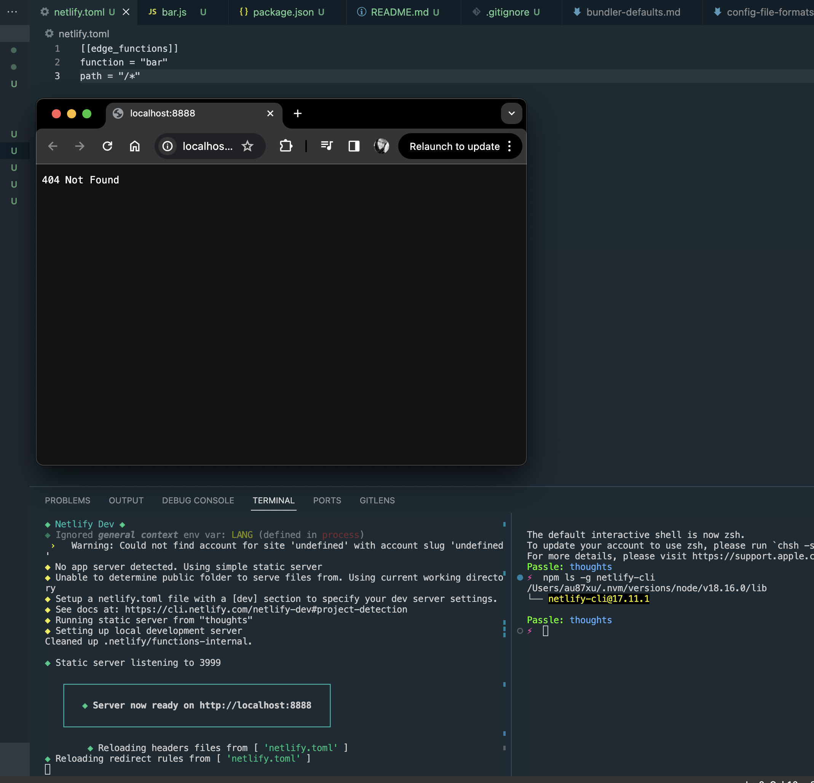

# Expected

When I run `npm start` (or `netlify dev`), I see my edge function running in the browser

# Actual

After running `netlify deploy` however, it does work:
https://65984a1a2f4c4e3a89e1ab3e--passle.netlify.app/
https://65984a1a2f4c4e3a89e1ab3e--passle.netlify.app/foo

